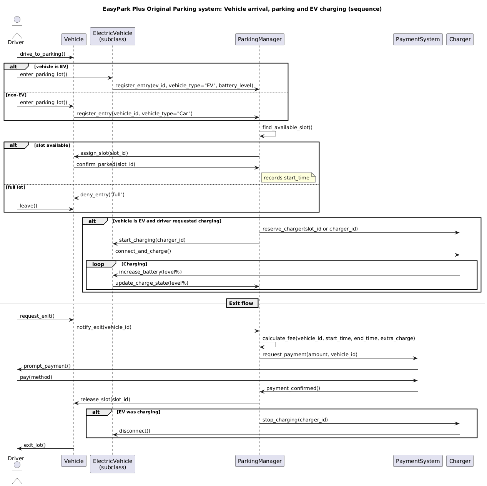
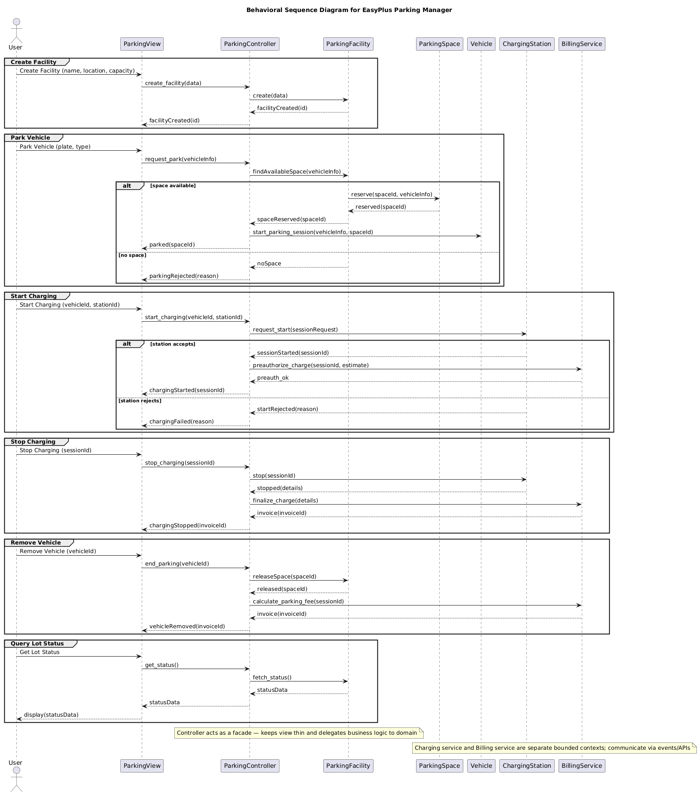

# Parking Manager — Original vs Revised

This repository contains two versions of a Parking Manager project: the original implementation and a revised, refactored version. This README explains the situation, what changed, and how to run or inspect the revised version. Diagrams illustrating the original and the revised designs are stored in `docs/` as PNGs; the README references them directly.

---

## Repository layout (relevant folders)

- `original_code/` — The original project implementation (legacy code).
  - Example files: `ParkingManager.py`, `Vehicle.py`, `ElectricVehicle.py`, `uml_diagrams/`.

- `revised_code/` — The revised / refactored implementation.
  - Organized into `models/`, `controllers/`, and `views/`.
  - Example files: `revised_code/models/vehicle.py`, `revised_code/models/space.py`, `revised_code/controllers/parking_controller.py`, `revised_code/views/parking_view.py`.

- `docs/` — Documentation images (PNG) used by this README and for quick visual comparison.
  - `docs/original_behaviral_uml.png` — UML diagram showing the original design (note filename as stored).
  - `docs/final_revised_uml.png` — UML diagram showing the revised design.

---

## High-level summary

What was (original):

- A single-module / small multi-file application implementing parking-lot functionality (see `original_code/`).
- Implementation uses procedural / object-based approach (e.g., `ParkingManager.py` with a `ParkingLot` class plus `Vehicle`/`ElectricVehicle` types). The original code contains a simple GUI and direct data structures for slots and EV slots.

What is now (revised):

- A refactored version in `revised_code/` that follows a clearer separation of concerns (roughly MVC):
  - `models/` contains domain objects (vehicle, space, etc.).
  - `controllers/` contains the parking logic and orchestration.
  - `views/` contains UI-related code.
- The revised code aims to be more testable, modular, and maintainable — easier to extend (for example, to add different UI front-ends or storage back-ends).

Visual comparison

Original behavioral UML:



Revised behavioral UML:



---

## Notable changes in the revision

- Reorganized file structure into `models/`, `controllers/`, `views/` instead of large monolithic scripts.
- Reworked the parking data model: introduced `Space`/`Slot` and clearer `Vehicle` model to decouple representation from UI.
- Improved naming and encapsulation (example: `parking_controller.py` handles parking/leave/query logic, models are thin data classes).
- Removed or isolated GUI-specific code from core parking logic to enable headless tests and alternative UIs.

## How to run the revised version (quick)

1. From the project root, run the revised controller/view entrypoint. Example (Python 3.10+):

```bash
# activate your virtualenv if you use one
python -m revised_code.views.parking_view
```

2. If there is a module-level `main()` in a controller or view, you can also run that directly. Check `revised_code/README.md` for project-specific commands.

Notes:
- The revised code expects to be imported as a package, so ensure the project root is on `PYTHONPATH` when running (running from the project root usually works).
- If you prefer a headless test run, import `revised_code.controllers.parking_controller` and instantiate the controller and models directly.

## Files of interest

- `original_code/ParkingManager.py` — original GUI and parking logic combined.
- `original_code/Vehicle.py`, `original_code/ElectricVehicle.py` — original vehicle model implementations.
- `revised_code/models/vehicle.py` — revised vehicle model.
- `revised_code/models/space.py` — revised parking space model.
- `revised_code/controllers/parking_controller.py` — revised parking logic.
- `revised_code/views/parking_view.py` — revised view (entrypoint for the GUI/front-end).

## Images and documentation

All images used in this README live in `docs/` and are referenced with `.png` paths:

- `docs/original_behaviral_uml.png`
- `docs/final_revised_uml.png`

If you add or regenerate diagrams, place them in `docs/` and reference them by filename.

---

## Next steps / recommendations

- Add a short test harness or unit tests for `revised_code/controllers/parking_controller.py` to validate core behavior (park, leave, query) automatically.
- Consider adding a top-level `pyproject.toml` or `requirements.txt` documenting runtime dependencies (e.g., Tkinter is standard, but other packages might be required for additional views).
- If you want, I can:
  - Create a small example script that exercises the revised controller (headless).
  - Add a small CONTRIBUTING.md describing how to run and test the revision.

---
